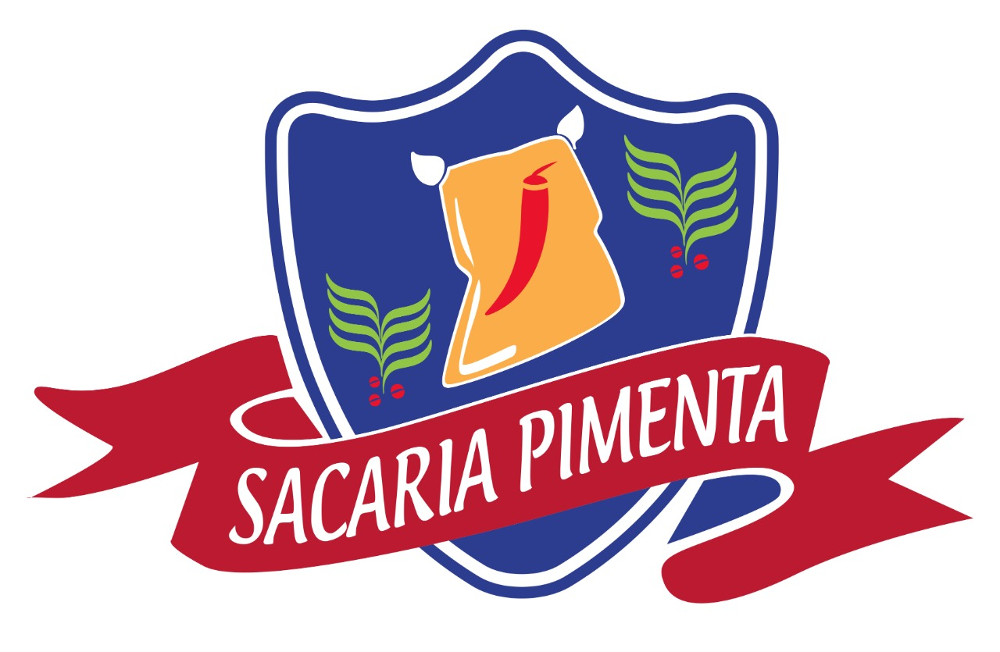

  

## Tecnologias

Esse projeto foi desenvolvido com as seguintes tecnologias:

- [HTML5]
- [CSS3]
- [JavaScript]

## Projeto

O Sacaria Pimenta é um site para demonstrar alguns produtos de sacos de ráfia.

## Contribuir

- Faça um fork desse repositório;
- Cria uma branch com a sua feature: `git checkout -b minha-feature`;
- Faça commit das suas alterações: `git commit -m 'feat: Minha nova feature'`;
- Faça push para a sua branch: `git push origin minha-feature`.
Esse projeto foi desenvolvido com os ensinamentos da rocketseat
Depois que o merge da sua pull request for feito, você pode deletar a sua branch.

Feito por  [Wandson Gomes](https://www.linkedin.com/in/wandson-gomes-a759ba51/) 💻
